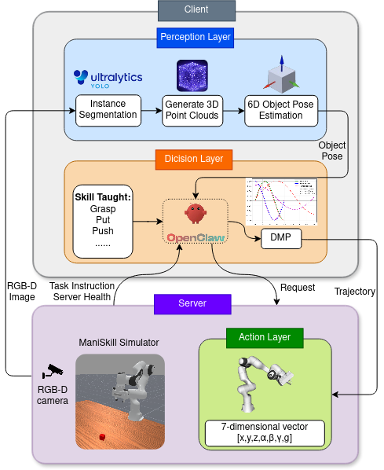
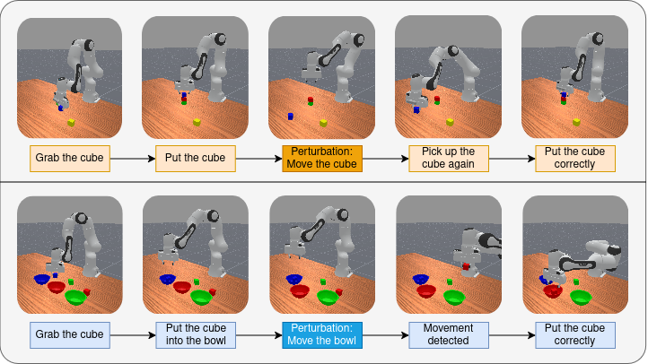

# VigiClaw



​	VigiClaw 是一个基于 OpenClaw 的机械臂仿真与控制项目，使用的仿真环境是ManiSkill。用于把Openclaw接入到ManiSkill仿真环境中，然后用自然语言指令控制机械臂完成任务。VigiClaw名称是Vigilant Openclaw的缩写，代表警觉的Openclaw。这个项目也可以使用其他Agent框架如codex。论文名称：**VigiClaw: Action-Triggered State Verification for Robust Long-Horizon Robotic Manipulation**。

## 环境要求

- Linux 或其他支持 SAPIEN/ManiSkill 的系统
- Python `>=3.10,<3.13`
- 可用的 GPU/图形环境，因为开启仿真。
- ManiSkill `>=3.0.1`

## 安装

### 使用 uv（推荐）

```bash
git clone https://github.com/<your-name>/VigiClaw.git
cd VigiClaw

uv venv
uv sync
source .venv/bin/activate
```

### 使用 pip

```bash
git clone https://github.com/<your-name>/VigiClaw.git
cd VigiClaw

python3 -m venv .venv
source .venv/bin/activate
pip install -e .
```

视觉 Skill 脚本还需要额外依赖，按实际使用的脚本安装：

```bash
pip install requests numpy Pillow opencv-python ultralytics
```

### 安装YOLO 环境

本项目的物体检测和视觉定位 Skill 使用 Ultralytics YOLO，推荐使用名为 `yolo26` 的 Conda 环境：

```bash
conda create -n yolo26 python=3.10 -y
conda activate yolo26
pip install requests numpy Pillow opencv-python ultralytics
```

如果 `yolo26` 环境已经存在，只需要执行：

```bash
conda activate yolo26
pip install requests numpy Pillow opencv-python ultralytics
```

运行视觉脚本前，请确保已经激活该环境：

```bash
conda activate yolo26
cd skill/scripts
conda run -n yolo26 python object_detect.py
```

### 安装OpenClaw

这里默认安装完成OpenClaw。

## OpenClaw 任务列表

项目通过 `openclaw_task` 注册了以下 OpenClaw 任务：

| 任务名称                     | 任务简介                                                     | 是否可用 |
| ---------------------------- | ------------------------------------------------------------ | -------- |
| `OpenclawPickCube`           | 抓取红色方块，并将其提起到指定高度。                         | √        |
| `OpenclawPickCup`            | 从两个颜色不同但形状相同的杯子中，抓取指定目标杯子并提起。   | √        |
| `OpenclawPickBanana`         | 抓取香蕉，并将其提起到指定高度。                             | √        |
| `OpenclawMoveApple`          | 抓取苹果，按照随机指定的方向移动一定距离后放下。             | √        |
| `OpenclawPutBananaOnPlate`   | 抓取香蕉并将其放到盘子上。                                   | √        |
| `OpenclawStackCubes`         | 按顺序将红色方块堆叠到绿色方块上、蓝色方块上，最后将黄色方块堆叠到蓝色方块上。 | √        |
| `OpenclawDailyScene`         | 在包含棒球、香蕉、杯子、苹果和马克笔的日常场景中，根据指令抓取工具（默认指马克笔）。 | √        |
| `OpenclawPutTogether`        | 将红、绿、蓝三个方块分别放入对应颜色的碗中。                 | √        |
| `OpenclawStackCubesDisturb`  | 完成红、绿、蓝方块的堆叠，并将蓝色方块堆叠到红色方块上；任务过程中可能发生方块干扰。 | √        |
| `OpenclawPutTogetherDisturb` | 将方块放入对应颜色的碗中；任务过程中可能出现方块回移或碗移动等干扰。 | √        |
| `OpenclawOpenCabinet`        | 打开柜子，并抓取柜子内部的物体。                             | ×        |
| `OpenclawPushCube`           | 推动目标方块，按照随机指定的方向移动一定距离。               | √        |
| `OpenclawObstacleAvoid`      | 绕过蓝色障碍物，抓取红色方块并将其提起。                     | ×        |

## 使用流程

### 服务端：

查看 OpenClaw 自定义任务：

```bash
PYTHONPATH=/home/lpx/python-project/VigiClaw uv run python -c "import mani_skill.envs; import openclaw_task; from mani_skill.utils.registration import REGISTERED_ENVS; print('\\n'.join(sorted(k for k in REGISTERED_ENVS if k.startswith('Openclaw'))))"
```

仿真服务端启动时会导入 `openclaw_task`，自动注册工程内的自定义任务。

默认服务地址：

```text
http://127.0.0.1:8000
```

在第一个终端启动仿真服务端，仿真服务端支持通过 `--task` 选择要运行的 OpenClaw 任务，默认任务为 `OpenclawMoveApple`：

```bash
cd openclaw_control
python server.py --task OpenclawPickCube	# 这里选择传入 OpenClaw 自定义任务中的一个任务即可
```

也可以通过命令行设置 episode 轮数：

```bash
python server.py --task OpenclawPickCube --episode_nums 5
```

任务完成 5 个 episode 后，仿真服务端会自动退出。

### 客户端：

然后启动OpenClaw或其他Agent框架,先输入：

```
请学习一下 根目录地址/skill。
```

然后输入：

```
我开启了服务器，请完成任务。
```

就可以看到机械臂完成任务的过程。



## 开源协议

项目协议 Apache License Version 2.0。
